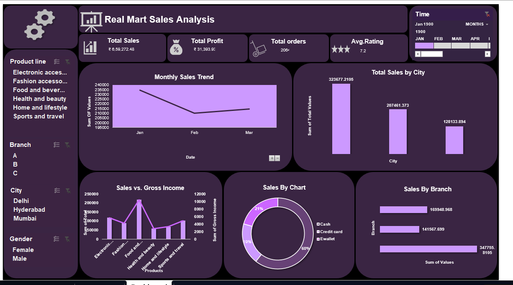

# Excel-Projects
# Real Mart Sales Analysis — Excel Dashboard

An interactive Excel dashboard analyzing sales performance for Real Mart across
branches, cities, product lines, and payment methods, built using pivot tables
and pivot charts.

## Business problem

Real Mart wanted a single view to understand:
- How sales are trending month over month
- Which cities and branches are driving (or dragging) performance
- Which product lines contribute most to revenue
- How customers are paying, and whether that affects sales mix

## Dashboard components

- **KPI cards**: Total Sales (₹8,59,272), Total Profit (₹31,393), Total Orders
  (2,084), Average Rating (7.2)
- **Monthly Sales Trend** — line chart tracking sales from Jan–Apr
- **Total Sales by City** — bar chart comparing Delhi, Hyderabad, and Mumbai
- **Sales vs Gross Income by Product Line** — combo chart across 6 product
  categories (Electronics Accessories, Fashion Accessories, Food & Beverages,
  Health & Beauty, Home & Lifestyle, Sports & Travel)
- **Sales by Payment Method** — donut chart (Cash / Credit Card / E-Wallet)
- **Sales by Branch** — horizontal bar chart across Branch A, B, and C
- **Slicers** for Product Line, Branch, City, Gender, and Time — allows
  interactive filtering across all visuals at once

## Key findings

- One city accounted for roughly 60% more sales than the next-highest city,
  suggesting uneven regional performance worth investigating (staffing,
  local demand, or marketing spend differences).
- E-Wallet was the dominant payment method (~60% of transactions), well ahead
  of Credit Card and Cash — a signal that digital payment infrastructure and
  promotions are working, or that a strong digital-payment incentive is worth
  A/B testing further.
- Branch-level sales varied significantly, with the top branch outperforming
  the lowest by more than 2x — a useful basis for a manager-level review of
  what the top branch is doing differently.
- Monthly sales dipped from January into February before recovering slightly
  into March — worth checking against seasonality or a specific event in
  that period.

## Files

- `RealMart_Sales_Dashboard.xlsx` — the interactive dashboard with pivot
  tables, pivot charts, and slicers
- `Dashboard.png` — static screenshot of the dashboard

